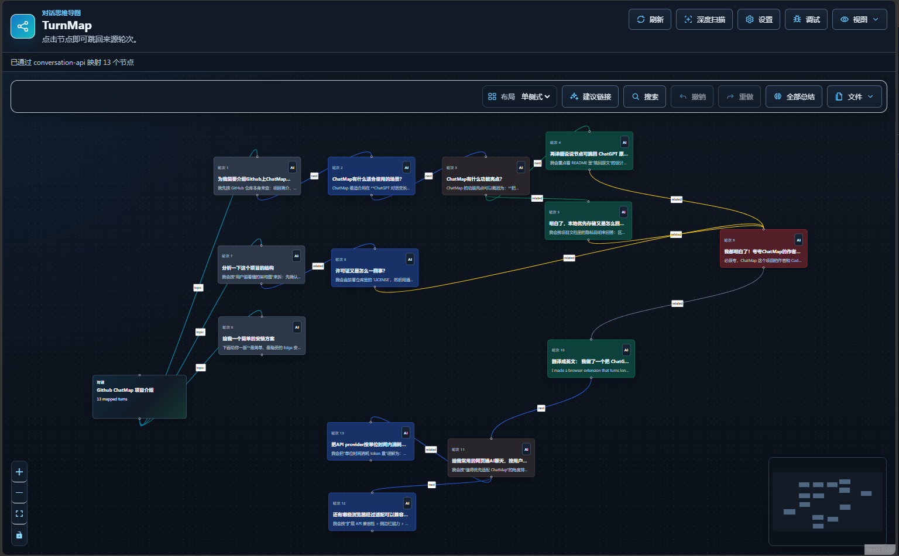

# TurnMap

[English](README.md) | [中文](README.zh-CN.md)

Turn AI conversations into editable, jumpable, exportable mind maps.

TurnMap is an Edge-first browser extension that maps the current AI conversation into a visual graph. Each question-answer turn becomes a node. Nodes can jump back to the original source message, be edited, linked, colored, collapsed, marked as important, summarized with AI, exported, and restored later.

> Status: early preview. TurnMap is not yet published to Edge Add-ons or Chrome Web Store. Install it manually from source or from a GitHub Release package.



## What It Is For

TurnMap is designed for:

- Personal learning and review.
- Long AI conversation navigation.
- Research, writing, and knowledge organization inside a single conversation.

It currently maps the active conversation on supported AI websites. Cross-conversation knowledge graphs are out of scope for the first release.

## Highlights

- **Conversation map**: turns the current AI conversation into a node map.
- **Supported websites**: ChatGPT, Gemini, Claude.ai, DeepSeek, Kimi, Doubao, Qwen, Google AI Studio, Perplexity, Grok, GLM / Z.ai / Zhipu Qingyan, Mistral Le Chat, and Arena / LMArena.
- **Jump to source**: return from a map node to the original source turn.
- **Editable graph**: edit titles, summaries, tags, statuses, notes, hidden nodes, and links.
- **Node resizing**: drag the left, right, and bottom resize handles, or the lower-left/lower-right corners, to save custom node proportions.
- **AI answer expansion**: with an API key configured, turn one assistant answer into a compact title-only mini-map inside the original node; failed or invalid AI output does not change the node.
- **Custom node appearance**: color nodes, collapse long content, mark important nodes, and tune color rendering with gradient or background modes.
- **Topic groups and batch editing**: collapse selected turns into a restorable topic node, batch add/remove tags, and batch edit selected link type/color/importance.
- **Semantic links**: link colors are clearer and consistent with node color presets; link weights affect line thickness/opacity, and important links can be emphasized more strongly.
- **Connection style preference**: choose Curved or Angled normal-node links in Interface settings. Mini-map links are intentionally unchanged.
- **Graph hygiene**: imports, exports, layout changes, and topic groups run local health checks that repair safe defaults, drop invalid dangling/proxy edges, and write concise status/task-log entries.
- **AI assist preview**: summarize nodes, suggest high-confidence semantic links, and generate custom UI translations, with provider compatibility still being improved.
- **Topic Analysis MVP**: locally preclassify high-signal candidate links from node metadata before optional AI review.
- **More appearance controls**: light, dark, eye-care, and browser-following themes, plus layout and rendering defaults.
- **Multiple views**: Side Panel, Full Page, and Float.
- **Settings Page**: manage AI, interface defaults, theme, language, launcher, Float, and update preferences outside the map workspace.
- **Page launcher**: a small right-side launcher on supported AI pages. Left-click opens TurnMap; right-click opens settings.
- **Cleaner tab organization**: related display options are grouped so Side Panel, Full Page, Float, and border/display controls do not crowd the map workspace.
- **Multiple layouts**: Single-side, Radial, Matrix, and Two-sided.
- **Import/export**: TurnMap JSON, Obsidian Canvas, OPML, Obsidian vault Markdown, Markdown, SVG, and PNG. Prefer TurnMap JSON when you need complete save/restore, including answer expansions, current display modes, topic groups, link weights, and graph metadata.
- **Local-first storage**: graph state is saved per conversation in the browser profile.

## Current Views

| View | Purpose |
| --- | --- |
| Side Panel | Work beside a supported AI conversation in Edge's side panel. |
| Full Page | Use a larger map canvas while staying linked to the source conversation tab. |
| Float | Use a compact in-page navigator on supported AI pages. |
| Page Launcher | Use a small right-side launcher on supported AI pages to open TurnMap or settings. |

## Planned Before Public Release

These items are planned before a wider public release:

- **Update Notice**: notify users when a new GitHub Release or store version is available.
- **More AI chat sites**: continue improving adapters for supported web AI products and add more sites as their page structures stabilize.Welcome to let me know your favourates!
- **More browsers**: extend compatibility beyond Edge, especially Chrome (and maybe Firefox).
- **More AI providers**: broaden API key support for more OpenAI-compatible and mainstream model providers.
- **Stronger organization features**: improve local topic analysis, AI summaries, AI suggested links, provider compatibility, and task-log based troubleshooting.

## Install From Source

Requirements:

- Node.js
- Microsoft Edge
- A supported web AI session

Build:

```powershell
npm install
npm.cmd run build
```

Load in Edge:

1. Open `edge://extensions`.
2. Enable Developer mode.
3. Click Load unpacked.
4. Select `<project-root>\dist`.
5. Open a supported AI conversation.
6. Open TurnMap from the extension action or Edge side panel.

## Install From GitHub Release

For preview builds, download the release zip from GitHub Releases, unzip it, and load the unpacked folder in Edge developer mode.

GitHub/unpacked installs require manual updates. Store distribution is the right path for automatic browser-managed updates.

Latest preview package: `turnmap-v0.7.1.zip`. This release highlights API-powered answer expansion into compact mini mind maps, clearer mini-map layout and export rendering, stronger graph hygiene, stable newly generated turn IDs, weighted links, proxy edge metadata, ChatGPT extraction repair, and appearance customization such as normal-link style selection plus persistent color previews. For long-term backup or transfer, export TurnMap JSON first because it preserves TurnMap-specific editing state more completely than visual formats.

## Basic Usage

1. Open a supported AI conversation.
2. Open TurnMap.
3. Click Refresh to read the full current conversation.
4. Choose a layout: Single-side, Radial, Matrix, or Two-sided.
5. Single-click a node to select it and use Node Actions.
6. Right-click node body text to jump back to the source page.
7. Edit nodes, color nodes, collapse long nodes, mark important nodes, or create links as needed.
8. Drag the left, right, or bottom handle, or the lower-left/lower-right corner, to resize a node.
9. Select a turn node and use Node Actions to expand the answer into a mini-map. This requires a configured API key.
10. Select multiple nodes to batch tag them or collapse them into a restorable topic node.
11. Select links to use Link Actions for color/type, weight, importance, labels, and notes. Multi-selected links can receive one shared weight.
12. Use Files to export or import a map. Use TurnMap JSON first for complete editable recovery.

## Appearance and Interface Settings

TurnMap has a dedicated settings page for global UI preferences:

- **Theme**: light, dark, eye-care, or follow browser.
- **Language**: follow browser, English, Chinese, and locally saved AI-generated custom UI translations.
- **Default layout**: Single-side, Radial, Matrix, or Two-sided.
- **Node color rendering**: choose gradient or solid background rendering and adjust color intensity.
- **Link style**: choose curved or angled normal-node links. Mini nodes and their internal mini-map links keep their compact built-in style.
- **AI output budget**: adjust `max_tokens`, which caps output length but does not change the model's context window.
- **Entry points**: manage Side Panel, Full Page, Float, and page launcher preferences.

## AI Features

TurnMap supports providers that expose an OpenAI-compatible `/chat/completions` API. Provider presets are convenience defaults for fast, lower-cost, context-friendly models; users can still edit the base URL and model when their account, region, or endpoint requires a different value.

Supported presets:

- OpenAI
- DeepSeek
- OpenRouter
- Qwen / DashScope
- Kimi / Moonshot
- Doubao / Volcano Ark
- Zhipu / GLM
- Mistral
- Gemini compatible
- Custom OpenAI-compatible endpoint

AI features are currently preview capabilities and are not yet fully reliable across every provider:

- **Summarize**: generate compact node titles and summaries, with provider JSON/text response compatibility still being improved.
- **Analyze Topics**: locally preclassify likely topic-related link candidates from node titles, summaries, tags, distance, and existing links, then show them for review before changing the graph.
- **Suggest Links**: propose strong semantic links between non-adjacent related nodes, with thresholds and visual density still being tuned.
- **AI translation**: generate local UI language packs with the user's API key, import/export standard JSON language packs, and fall back to English for missing labels.
- **Auto summarize**: summarize new/default nodes when enabled.

Future versions will continue improving AI summaries, AI suggested links, provider compatibility, and task-log based troubleshooting.

API keys are saved in the browser extension's local storage under the user's local browser profile. Paste the raw key only, without a `Bearer ` prefix. Some providers use the model field as an endpoint ID, and the base URL is always the request entry point rather than part of the key.

TurnMap keeps larger task-level output budgets for summarization, link suggestions, and AI UI translation while leaving `maxTokens` configurable up to 24000. AI translation sends only TurnMap UI labels, may make one extra API call to repair malformed JSON, and stores generated/imported language packs locally. See [AI Provider Guide](docs/ai-provider-guide.md) for provider defaults, language-pack format, response-format requirements, and token-budget notes.

## Privacy

By default, TurnMap stores conversation maps locally in the browser extension storage. Analyze Topics runs locally and uses node metadata already present in the map. AI features send selected conversation text to the provider configured by the user. Exports are controlled by the user.

See [Privacy Statement](docs/privacy-statement.md).

## Permissions

TurnMap requests the minimum permissions currently needed for the preview build:

- `activeTab`, `tabs`, and `scripting` to find the active supported AI conversation tab, inject the content script when needed, open Full Page mode, and jump back to source turns.
- `sidePanel` to provide the Edge side panel UI.
- `storage` to save maps, settings, AI provider configuration, launcher position, and Float state locally.
- `webRequest` to support full conversation extraction from ChatGPT backend requests when available.
- Host access to supported AI chat websites and built-in AI provider API hosts.
- Optional host access for custom OpenAI-compatible providers, requested only when the user configures a custom endpoint.

See [Permission Review](docs/permissions-review.md).

## Development

```powershell
npm.cmd run dev
npm.cmd run typecheck
npm.cmd run build
npm.cmd run package
```

`npm.cmd run package` creates a zip package in `release/`.

## Project Structure

```text
src/content       Site adapters, extraction, jumping, Float, launcher-related code
src/side-panel    Main TurnMap UI
src/full-page     Full Page entrypoint
src/background    MV3 service worker
src/shared        Shared message and type definitions
docs              User, developer, privacy, and release docs
scripts           Build and packaging helpers
```

## Documentation

- [User Guide](docs/user-guide.md)
- [Developer Guide](docs/developer-guide.md)
- [AI Provider Guide](docs/ai-provider-guide.md)
- [Privacy Statement](docs/privacy-statement.md)
- [Permission Review](docs/permissions-review.md)
- [Release Readiness](docs/release-readiness.md)
- [GitHub Release Plan](docs/github-release-plan.html)

## Known Limitations

- AI website page structures can change without notice.
- Repeated identical prompts can reduce jump precision in some conversations.
- GitHub/unpacked installs cannot be silently auto-updated by the extension itself.
- Store submission may require PNG icons and additional privacy materials.
- AI translation, AI summaries, and AI suggested links depend on provider request and response behavior and remain preview features.

## Roadmap

- `0.1.x`: stabilize AI fallback and Float / Full Page small-screen behavior while keeping current extraction and jumping stable.
- `0.2.0`: add GitHub Release checks, ignored versions, remind-later update notices, and redacted debug reports.
- `0.3.0`: add collaboration and advanced export paths. OPML and Obsidian vault Markdown are implemented; XMind remains the next priority before Anki CSV.
- `0.4.0`: add adapters for ChatGPT, Gemini, Claude.ai, DeepSeek, Kimi, Doubao, Qwen, Google AI Studio, Perplexity, Grok, GLM / Z.ai / Zhipu Qingyan, Mistral Le Chat, and Arena / LMArena. After the current plan is complete, continue with MiniMax Agent.
- `0.5.0`: expand API key and provider compatibility with cost-aware presets for OpenAI, DeepSeek, OpenRouter, Qwen, Kimi, Doubao, Zhipu, Mistral, Gemini-compatible Vertex endpoints, and Custom OpenAI-compatible endpoints.
- `0.5.1`: complete AI UI translation language packs with generation, import/export, JSON repair, local storage, and layout-safety safeguards.
- `0.6.0`: add local Topic Analysis that preclassifies high-confidence candidate links for review without provider embeddings.
- `0.7.0`: improve knowledge organization with answer mini mind maps, smarter links, batch link review, topic collapse, bulk tags, and saved node sizing.
- `0.7.1`: refine mini mind maps and appearance customization while hardening graph hygiene and automatic link reliability with stable new turn IDs, link weights, topic proxy metadata, and local repair logs.
- `0.8.0`: migrate compatibility to Chrome; Firefox is reserved for a later sidebar-specific phase.
- `0.9.0`: public beta with 100+ node performance, overflow-safe large-map export, and cancellable AI batch jobs.
- `0.10.0`: prepare store publication, with Edge Add-ons first and Chrome Web Store following Chrome compatibility.
- `1.0.0`: stable release after privacy, permissions, docs, QA, and install/recovery paths are complete.
- `1.1.0`: experimental fine-grained graph expansion after the stable release.

Release details:

- [0.6.0 release notes](docs/release-notes-0.6.0.md) describe the changes since the previous GitHub push.

## Contributing

Bug reports, feature requests, and AI provider compatibility reports are welcome through GitHub Issues.

Before opening a pull request, run:

```powershell
npm.cmd run typecheck
npm.cmd run build
```

See [CONTRIBUTING.md](CONTRIBUTING.md).

## Security

Do not commit API keys, private conversation exports, browser profile data, or screenshots containing private conversations.

See [SECURITY.md](SECURITY.md).

## License

MIT. See [LICENSE](LICENSE).
