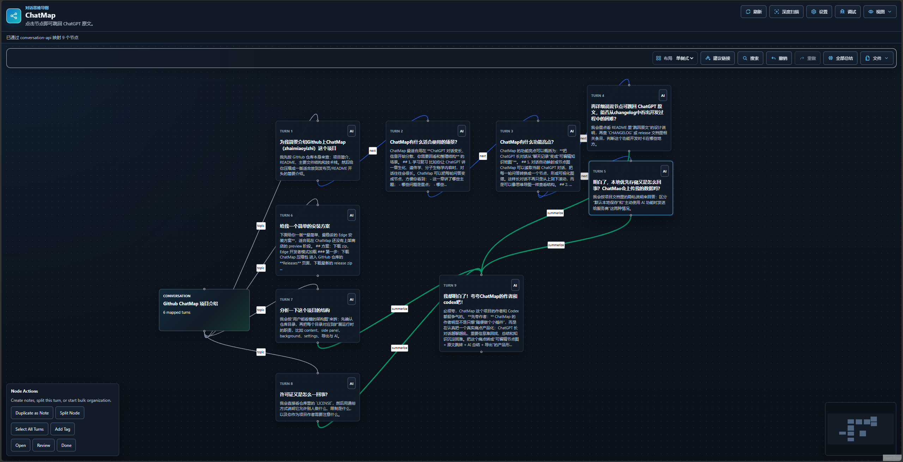

# ChatMap

[English](README.md) | [中文](README.zh-CN.md)

Turn ChatGPT conversations into editable mind maps.

ChatMap is an Edge-first browser extension that maps the current ChatGPT conversation into a visual graph. Each question-answer turn becomes a node. Nodes can jump back to the original ChatGPT message, be edited, linked, summarized with AI, exported, and restored later.

> Status: early preview. ChatMap is not yet published to Edge Add-ons or Chrome Web Store. Install it manually from source or from a GitHub Release package.



## What It Is For

ChatMap is designed for:

- Personal learning and review.
- Long ChatGPT conversation navigation.
- Research, writing, and knowledge organization inside a single conversation.

It currently maps the active ChatGPT conversation only. Cross-conversation knowledge graphs are out of scope for the first release.

## Highlights

- **Conversation map**: turns the current ChatGPT conversation into a node map.
- **Jump to source**: click a node to return to the original ChatGPT turn.
- **Editable graph**: edit titles, summaries, tags, statuses, notes, hidden nodes, and links.
- **Semantic links**: relationship types have distinct colors; important links can be emphasized.
- **AI assist**: summarize nodes and suggest high-confidence semantic links.
- **Multiple views**: Side Panel, Full Page, and Float.
- **Settings Page**: manage AI, interface defaults, launcher, Float, and update preferences outside the map workspace.
- **ChatGPT launcher**: a small right-side launcher on ChatGPT pages. Left-click opens ChatMap; right-click opens settings.
- **Multiple layouts**: Single-side, Radial, Matrix, and Two-sided.
- **Import/export**: ChatMap JSON, Obsidian Canvas, Markdown, SVG, and PNG.
- **Local-first storage**: graph state is saved per conversation in the browser profile.

## Current Views

| View | Purpose |
| --- | --- |
| Side Panel | Work beside ChatGPT in Edge's side panel. |
| Full Page | Use a larger map canvas while staying linked to the source ChatGPT tab. |
| Float | Use a compact in-page navigator on ChatGPT. |
| ChatGPT Launcher | Use a small right-side launcher on ChatGPT pages to open ChatMap or settings. |

## Planned Before Public Release

These items are planned before a wider public release:

- **Update Notice**: notify users when a new GitHub Release or store version is available.
- **More AI chat sites**: explore support for well-known web AI products such as Doubao, DeepSeek, Kimi, Gemini, Grok, and others.
- **More browsers**: extend compatibility beyond Edge, especially Chrome and Firefox.
- **More AI providers**: broaden API key support for more OpenAI-compatible and mainstream model providers.

## Install From Source

Requirements:

- Node.js
- Microsoft Edge
- A ChatGPT web session

Build:

```powershell
npm install
npm.cmd run build
```

Load in Edge:

1. Open `edge://extensions`.
2. Enable Developer mode.
3. Click Load unpacked.
4. Select `<project-root>\dist`.
5. Open a ChatGPT conversation.
6. Open ChatMap from the extension action or Edge side panel.

## Install From GitHub Release

For preview builds, download the release zip from GitHub Releases, unzip it, and load the unpacked folder in Edge developer mode.

GitHub/unpacked installs require manual updates. Store distribution is the right path for automatic browser-managed updates.

## Basic Usage

1. Open a ChatGPT conversation.
2. Open ChatMap.
3. Click Refresh to read the full current conversation.
4. Choose a layout.
5. Click nodes to jump back to ChatGPT.
6. Edit nodes or create links as needed.
7. Use Files to export or import a map.

## AI Features

ChatMap supports providers that expose an OpenAI-compatible `/chat/completions` API.

Supported presets:

- OpenAI
- DeepSeek
- Custom compatible endpoint

AI features:

- **Summarize**: generate compact node titles and summaries.
- **Suggest Links**: propose strong semantic links between non-adjacent related nodes.
- **Auto summarize**: summarize new/default nodes when enabled.

API keys are saved in the browser extension's local storage under the user's local browser profile. They are not committed to this repository.

See [AI Provider Guide](docs/ai-provider-guide.md) for response-format requirements.

## Privacy

By default, ChatMap stores conversation maps locally in the browser extension storage. AI features send selected conversation text to the provider configured by the user. Exports are controlled by the user.

See [Privacy Statement](docs/privacy-statement.md).

## Permissions

ChatMap requests the minimum permissions currently needed for the preview build:

- `activeTab`, `tabs`, and `scripting` to find the active ChatGPT tab, inject the content script when needed, open Full Page mode, and jump back to source turns.
- `sidePanel` to provide the Edge side panel UI.
- `storage` to save maps, settings, AI provider configuration, launcher position, and Float state locally.
- `webRequest` to support full conversation extraction from ChatGPT backend requests when available.
- Host access to `chatgpt.com`, OpenAI, and DeepSeek.
- Optional host access for custom OpenAI-compatible providers, requested only when the user configures a custom endpoint.

See [Permission Review](docs/permissions-review.md).

## Development

```powershell
npm.cmd run dev
npm.cmd run typecheck
npm.cmd run build
npm.cmd run package
```

`npm.cmd run package` creates a zip package in `release/`.

## Project Structure

```text
src/content       ChatGPT extraction, jumping, Float, launcher-related code
src/side-panel    Main ChatMap UI
src/full-page     Full Page entrypoint
src/background    MV3 service worker
src/shared        Shared message and type definitions
docs              User, developer, privacy, and release docs
scripts           Build and packaging helpers
```

## Documentation

- [User Guide](docs/user-guide.md)
- [Developer Guide](docs/developer-guide.md)
- [AI Provider Guide](docs/ai-provider-guide.md)
- [Privacy Statement](docs/privacy-statement.md)
- [Permission Review](docs/permissions-review.md)
- [Release Readiness](docs/release-readiness.md)
- [GitHub Release Plan](docs/github-release-plan.html)

## Known Limitations

- ChatGPT page and backend behavior can change without notice.
- Repeated identical prompts can reduce jump precision in some conversations.
- GitHub/unpacked installs cannot be silently auto-updated by the extension itself.
- Store submission may require PNG icons and additional privacy materials.
- Custom AI providers depend on OpenAI-compatible request and response behavior.

## Roadmap

- `0.1.x`: stabilize extraction, jumping, storage, AI JSON handling, and Float behavior.
- `0.2.0`: add Update Notice and stronger ChatGPT compatibility.
- `0.3.0`: improve topic grouping, semantic linking, clustering, and bulk editing.
- `0.4.0`: prepare store listing assets, icon set, privacy materials, and release automation.
- `0.5.0`: start multi-site adapters for more AI chat websites, beginning with high-traffic services.
- `0.6.0`: broaden browser support for Chrome and Firefox while keeping Edge stable.
- `0.7.0`: expand AI provider presets and compatibility checks for more API key types.
- `1.0.0`: stable public release.

## Contributing

Bug reports, feature requests, and AI provider compatibility reports are welcome through GitHub Issues.

Before opening a pull request, run:

```powershell
npm.cmd run typecheck
npm.cmd run build
```

See [CONTRIBUTING.md](CONTRIBUTING.md).

## Security

Do not commit API keys, private conversation exports, browser profile data, or screenshots containing private conversations.

See [SECURITY.md](SECURITY.md).

## License

MIT. See [LICENSE](LICENSE).
